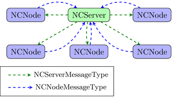
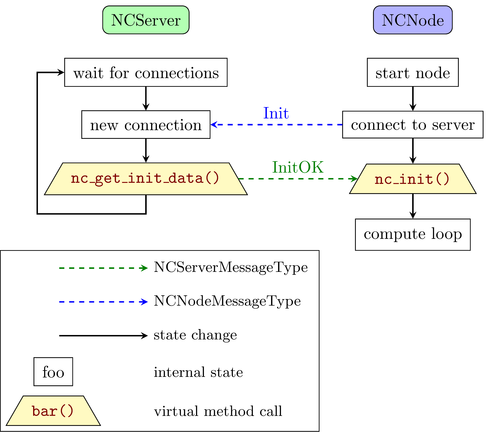
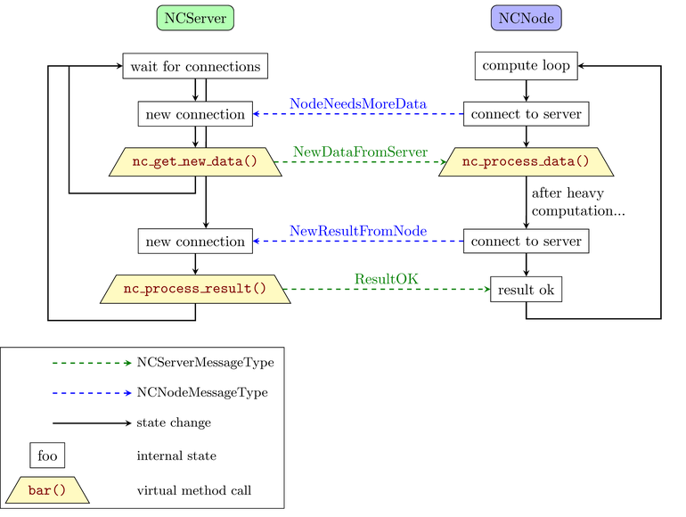
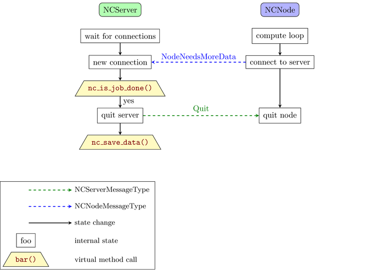
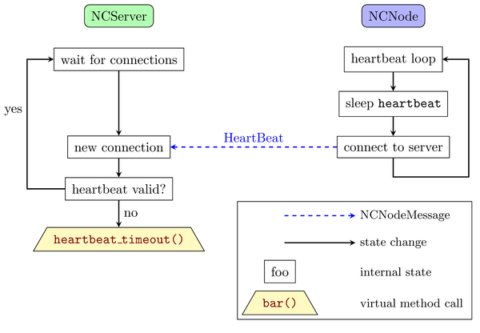

# Node Crunch 2

[](./LICENSE)

A client-server based network C++ library that allows to distribute computations across several compute nodes.
(Keywords: numeric computing, scientific computing, HPC, C++)

Version v0.1.0 (2026.02.01)

## Table of contents

- [Node Crunch 2](#node-crunch2)
  - [Table of contents](#table-of-contents)
  - [Features](#features)
  - [Introduction](#introduction)
    - [Start of node and server](#start-of-node-and-server)
    - [Node receives data from server and does computation, sends results back to server](#node-receives-data-from-server-and-does-computation-sends-results-back-to-server)
    - [All computation is done, server will exit](#all-computation-is-done-server-will-exit)
    - [Node sends heartbeat message to server](#node-sends-heartbeat-message-to-server)
  - [Server template](#server-template)
  - [Node template](#node-template)
  - [How to start the application](#how-to-start-the-application)
    - [Manually](#manually)
    - [Using SLURM / sbatch](#using-slurm--sbatch)
    - [Using PBS / Torque / qsub](#using-pbs--torque--qsub)
  - [Full working examples](#full-working-examples)
  - [How does it compare to *x* ?](#how-does-it-compare-to-x-)
    - [MPI](#mpi)
    - [BOINC](#boinc)
  - [TODO](#todo)
  - [FAQ](#faq)
  - [License](#license)

## Features

- Modern C++.
- Easy to use API. The user doesn't have to write any network code, just implement virtual functions.
- If one of the nodes crashes the server and all other nodes can still continue with their work. (Heartbeat messages are used internally.)
- While running the user application more nodes can be added dynamically to speed up computation even more.
- The nodes can be a mixture of different OS and hardware architectures, even different clusters at different locations. It just needs to have a network connection.

**Note 1:** *It is still in development and the API may change.*

**Note 2:** *The communication between the server and the nodes is compressed and encrypted using openssl with a shared key*

## Introduction

Node Crunch 2 is a library that allows users to write distributed C++ code easily. The code is organized in two main parts: one for the server and one for the node.

This is reflected in the two data processor classes that must be inherited by the user code:

<p align="center">
    
</p>

1. The **NCServerDataProcessor** class. This contains the functionality for splitting and collection the data that are send to the nodes and received back from the nodes. It has six methods that have to be implemented by the user:

    1.1 `std::vector<uint8_t> nc_get_init_data()`
    This is called when a node contacts the server for the first time. Here the server receives the unique node id from each node and stores it. The server creates some initial data (if needed) and sends it back to the node.

    1.2 `bool nc_is_job_done()`
    This is called whenever there is a connection from a node. If this method returns true, the server sends a quit message to the nodes, saves all the data and exits afterwards.

    1.3 `void nc_save_data()`
    Here the server saves all the result to disk before it exits.

    1.4 `void nc_node_timeout(NCNodeID)`
    If a node does not respond with a heartbeat message or a data message in time, this method is called. The server has a chance to mark this nodes data as unprocessed and give it to another node.

    1.5 `std::vector<uint8_t> nc_get_new_data(NCNodeID)`
    This method is called when the node needs more data to process. The server should have an internal list of unfinished data and send the next block to the node.

    1.6 `void nc_process_result(NCNodeID, std::vector<uint8_t>)`
    When the node has finished processing the data it is sent back to the server and this method handles it.

2. The **NCNodeDataProcessor** class. This contains the actual computaton for each data block that is sent by the server to the node. Each node processes the data and sends it back to the server. Here only two methods have to be implemented by the user:

    2.1 `nc_init(std::vector<uint8_t>)`
    This is the initial data that is sent once by the server to the node at the beginning when the node registers for the first time to the server.
    It can contain some initial data for the node state.

    2.2 `std::vector<uint8_t> nc_process_data(std::vector<uint8_t>)`
    Here the node gets a block of data to process from the server. The actual computation happens in this method.

### Start of node and server:

<p align="center">
    
</p>

### Node receives data from server and does computation, sends results back to server:

<p align="center">
    
</p>

### All computation is done, server will exit:

<p align="center">
    
</p>

### Node sends heartbeat message to server:

<p align="center">
    
</p>

## Server template

TODO

## Node template

TODO

## How to start the application

### Manually

Usually there is one binary for both the server and the node code. You just specify which mode is used for example with a command line.
For example we are using the switch "-s" to specify the server mode.
Since there is only one server and lots of nodes, the node mode should be the default:

```bash
./myapp -s & # option "-s" means run in server mode.

./myapp & # start one task in node mode, this is used more often so no need to specify this mode.

./myapp & # start another task in node mode.

./myapp --ip ip_of_server & # from a different computer.

```

### Using SLURM / sbatch

If you're using a HPC (high performance cluster) you will run new jobs through a job scheduler.
The mostly used one (at least in the [TOP500](https://www.top500.org/) list) is SLURM (Simple Linux Utility for Resource Management).

First start the server on one computer where the ip address is known (let's call it *ip_of_server*):

```bash
./myapp -s & # again here "-s" means run in server mode
```

Then make sure that the binary is available on all the compute node in the same folder / path.
Now you can start multiple jobs using the job scheduler, in this case start 8 jobs:

```bash
for i in {1..8}; do sbatch run_single.sbatch; done
```

The batch file "run_single.sbatch" may look like this, we're using the command line option "--ip" to specify the ip address of the server (*ip_of_server* from above):

```bash
#!/bin/bash -l
## Example run script for Node Crunch 2 with SLURM

## General configuration options
#SBATCH -J Node_Crunch_2
#SBATCH -o node_crunch_2.%j.%N.out
#SBATCH -e node_crunch_2.%j.%N_Err.out
#SBATCH --mail-user=my_email@somewhere.com
#SBATCH --mail-type=ALL

## Machine and CPU configuration
## Number of tasks per job:
#SBATCH -n 1
## Number of nodes:
#SBATCH -N 1
## How long will this job run at maximum, here for example 8 hours:
#SBATCH --time=08:00:00
## How much memory will this job consume at maximum, here for example 128 MB
#SLURM --mem-per-cpu=128

# Ensure that all the binaries are available on all the cluster nodes at the same place.
# Usually this is done in the cluster setup via NFS or some other distributed
# filesystem already.

# change this to the actual ip address of the system where the server is running.
myapp --ip ip_of_server
```

Now let's imagine that your code is running fine but it will take a lot of time before it is finished. What should you do ?
You can log in to the same cluster again (or a different cluster) and just start more nodes to help speed up the computation:

```bash
for i in {1..32}; do sbatch run_single.sbatch; done
```

This time we've just started additional 32 jobs, so we have a total of 8 + 32 = 40 jobs.

### Using PBS / Torque / qsub

Another commonly used job scheduler is PBS (Portable Batch System) or Torque. Again ensure that the binary is available on all compute nodes.
Then you can start multiple jobs (8 in this case):

```bash
for i in {1..8}; do qsub run_single.qsub; done
```

Here the file "run_single.qsub" may look like this:

```bash
#!/bin/bash -l
## Example run script for Node Crunch 2 with SLURM
#PBS -N Node_Crunch_2
#PBS -o ${PBS_JOBNAME}.out_${PBS_JOBID}
#PBS -j oe
## Mailing information a(bort),b(egin),e(nd)
#PBS -m abe
#PBS -M my_email@somewhere.com

## Machine and CPU configuration
## Number of tasks per job:
#PBS -l nodes=1:ppn=1
## How long will this job run at maximum, here for example 8 hours:
#PBS -l walltime=8:00:00
## How much memory will this job consume at maximum, here for example 128 MB
#PBS -l pmem=128mb

# Ensure that all the binaries are available on all the cluster nodes at the same place.
# Usually this is done in the cluster setup via NFS or some other distributed
# filesystem already.

# change this to the actual ip address of the system where the server is running.
myapp --ip ip_of_server
```

And again like with the other job scheduler you can just start additional jobs at any time to speed up the computation.

## Full working examples

Using the two traits looks complicated at first but there are a couple of examples that show how to use it in "real world" applications:

- Distributed [Mandelbrot](example/mandel/)
- TODO: Add more examples.

## How does it compare to *x* ?

### MPI

[MPI](https://www.open-mpi.org/) (Message Passing Interface) is the gold standard for distributed computing. It's battle tested, highly optimized and has support for C, C++ and Fortran. There are also bindings for other programming languages available.
Node Crunch 2 works mainly with C++ and is still in development. It is possible to call C / Fortran code.
Writing correct code in MPI is difficult and if one of the nodes crash all other nodes (including the main node) will be terminated. Node Crunch 2 on the other hand doesn't care if one of the nodes crash. The heartbeat system detect if one of the nodes is no longer available and the server continues with the other nodes.

The number of nodes in MPI is fixed the whole time once the application has started, whereas with Node Crunch 2 you can add more and more nodes while it's running if needed.
Using MPI you are limited what kind of CPU / architecture / operating system you use when you want to run your application on a cluster. With Node Crunch 2 you can mix different OS, CPUs and job scheduler as needed. You just have to compile the node code for each OS / hardware you want to use.

Another advantage of MPI is that memory can also be distributed across nodes. So of the data is too big to fit into the memory of one node it can be split up.
This can also be done with Node Crunch 2, since it doesn't need any specific memory layout. In the mandel example all the data is stored on the server. But the server could just pass a file name and an offset + size to each node and then the nodes would read in that huge file at that offset (which is different for each node) and just send the results back to the server (or write them to disk directly and let the server know the chunk of file was processed successfully). (An example to show how this is done needs to be provided)

### BOINC

[BOINC](https://boinc.berkeley.edu/) (Berkeley Open Infrastructure for Network Computing) is also used for distributed computing and is well tested and high-performance. Scientists use it to scale their computations massively by providing desktop clients that can run as screen savers on normal PCs, Macs, etc. It utilizes the resources that the computer is currently not using for numeric computations. The most famous (and first) application is the SETI@home client.
Node Crunch 2 is a lot smaller but also a lot easier to set up ;-)

## TODO

The user has to use their own way to de- / serialize all the data that is passed to and returned from the methods.
In the future there may be another option for dependency injecting a serialisazion object.

Other things that need to be done in the next releases:

- Maybe use the QUICK protokoll.

- Maybe add a small webserver witz a GUI.

- The library doesn't use any async code. Computations usually are more CPU bound than IO bound but there are always exceptions to this. So the currently used thread based strategy may be the limiting factor in some cases.

- More helper functions and data structures have to be provided. These will show up when there are more use cases and I'm happy to include them when they make sense.

- And of course refactoring and adding more and better documentation is always good ;-)

## FAQ

- Where does the name Node Crunch 2 come from ? Compute *node* and number *crunching*.
  Version 1 was written in [Rust](https://github.com/willi-kappler/node_crunch), then in [Nim](https://github.com/willi-kappler/num_crunch) and then in [Python](https://github.com/willi-kappler/parasnake). The newest verison 2 is written in modern C++.
- Will you add feature *x* ? It depends, if it makes sense and helps other users as well.
- Can I use OpenMP and / or GPGPU with Node Crunch 2 ? Yes of course, no problem. Have a look at the mandel2 example which uses Rayon (TODO: add GPU example).
- Can I use my C / Fortran / ... code with Node Crunch 2 ? In theory yes but you have to do some work (TODO: add example).

## License

This library is licensed under the MIT license.

